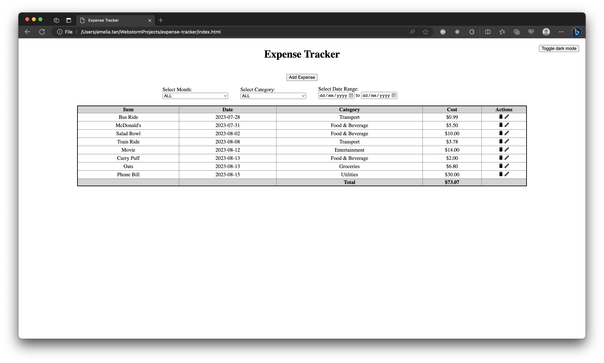
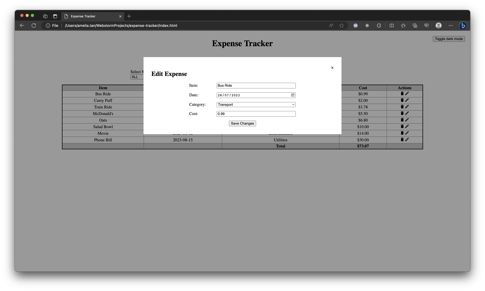
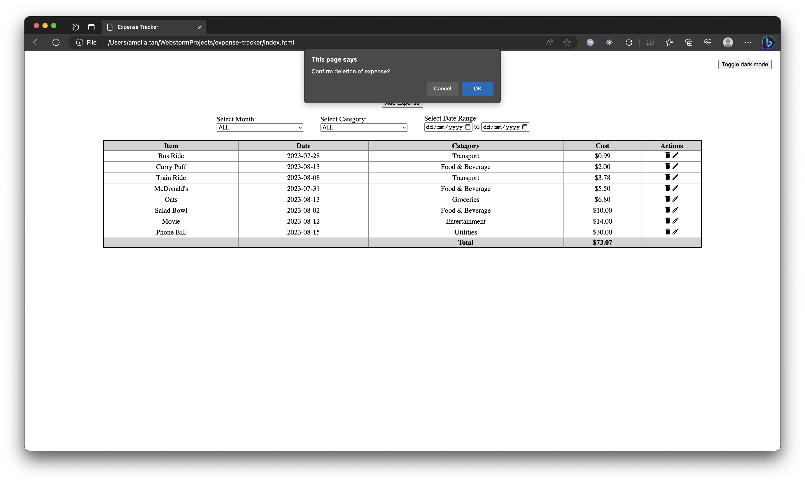
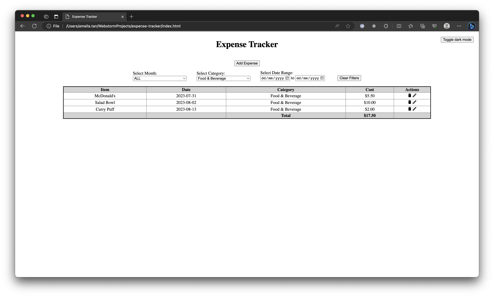
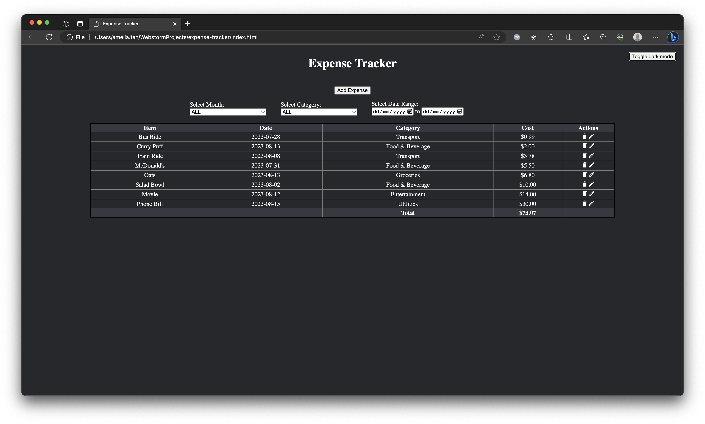

# expense-tracker
A simple expense tracker application built using HTML, CSS, and JavaScript to easily keep track of your expenses.

## Features
1. [Add New Expense](#1-add-new-expense)
2. [Edit/Delete Existing Expense](#2-editdelete-existing-expense)
3. [Filter Expenses](#3-filter-expenses)
4. [Sort Columns](#4-sort-columns)
5. [Light/Dark Mode](#5-lightdark-mode)

### 1. Add New Expense
Feature to add a new expense, specifying the item, date, category, and cost.
<figure>
    
    <figcaption style="text-align:center"><i>Fig 1. Add a new expense</i></figcaption>
</figure>

### 2. Edit/Delete Existing Expense
Feature to edit or delete an existing expense.
<figure>
    
    <figcaption style="text-align:center"><i>Fig 2. Edit an existing expense</i></figcaption>
</figure>
<figure>
    
    <figcaption style="text-align:center"><i>Fig 3. Delete an existing expense</i></figcaption>
</figure>

### 3. Filter Expenses
Feature to filter the expenses table by month, category, and/or date range.
<figure>
    
    <figcaption style="text-align:center"><i>Fig 4. Filter expenses table by category: Food & Beverage</i></figcaption>
</figure>

### 4. Sort Columns
Feature to sort the expenses table by any column ascending or descending.
<figure>
    
    <figcaption style="text-align:center"><i>Fig 5. Sort expenses table by ascending cost</i></figcaption>
</figure>

### 5. Light/Dark Mode
Feature to toggle dark mode.
<figure>
    
    <figcaption style="text-align:center"><i>Fig 6. Toggle dark mode</i></figcaption>
</figure>
